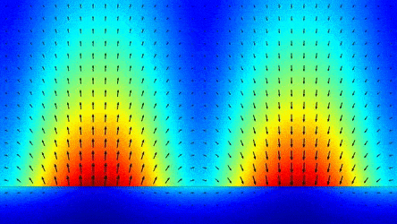

# Polarization effect on dressed SPP modes in plasmonic waveguides

We present the polarization effect on surface plasmonic polariton (SPP) modes in plasmonic waveguides under high-intensity radiation via the Floquet engineering methods. First, we analyze the strong light coupling to the metallic system using a nonperturbative procedure. Then, we describe the behavior of dressed metal fermion system using the Floquet state solutions. Furthermore, we examine the impurity scattering effects on electron transport in disordered plasmonic metals using the generalized Floquet-Fermi golden rule. We also show that we can reduce the SPP propagation losses in plasmonic metals by applying a dressing field. We introduce a new figure of merit (FoM) to compare the performance of popular plasmonic metals, assessing their performance enhancements under two different polarization types of dressing fields. Our study can be applied to accurately interpret the usage of strong external radiation as a tool in quantum plasmonic circuits and devices.

 

Please suggest any modifications that will improve these implementations by reporting an issue.
